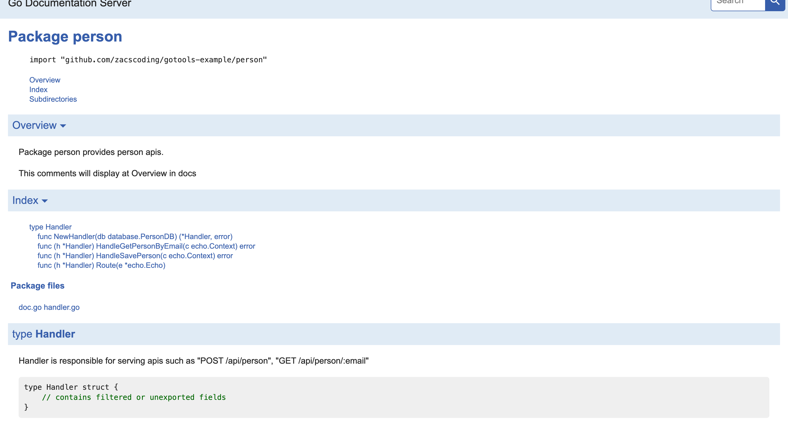

# :hammer: Go Tools Example

## Table of Contents

- [Go Docs](#Go-Docs)
- [Mocks](#Mocks)
- [Zap check](#Zap-check)

---  

## Go Docs

Start a new documentation server and connect to localhost:6060 at the browser

```shell
$ make doc
```  

  
(example of docs)

---  

## Mocks  

Generate mock files with [mockery](https://github.com/vektra/mockery).  

1. define interface with `go generate` comments  

```go
//go:generate mockery --name PersonDB --output ./mocks --filename person_mock.go
type PersonDB interface {
	// Save saves a given person to database.
	Save(ctx context.Context, person *model.Person) error
    ...
}
```

2. generate mock files

```shell
$ make generate
```  

---  

## Zap check  

Check ur misusage of zap.SugaredLogger's `With` fields by using [zapw](https://github.com/sethvargo/zapw).

For example, these usage of logger will occur panic because mismatch key values or invalid key type.

```go
func (h *Handler) HandleLoggingCheckFail(c echo.Context) error {
    logging.DefaultLogger().Warnw("normal usage", "key1", "value1")
    logging.DefaultLogger().Warnw("Mismatch key values", "mismatch") // panic occur
    logging.DefaultLogger().Infow("Invalid key type", 32)            // panic occur
    return nil
}
// Logs
//1.62255326311116e+09    dpanic  zap@v1.17.0/sugar.go:179        Ignored key without a value.    {"ignored": 32}
```  

Check ur usage of zap.SugaredLogger  

```shell
$ make zapcheck
/myworkpsace/gotools-example/person/handler.go:76:2: zap.SugaredLogger must have an even number of "With" elements
/myworkspace/gotools-example/person/handler.go:77:2: zap.SugaredLogger must have an even number of "With" elements
make: *** [zapcheck] Error 3
```

---  


